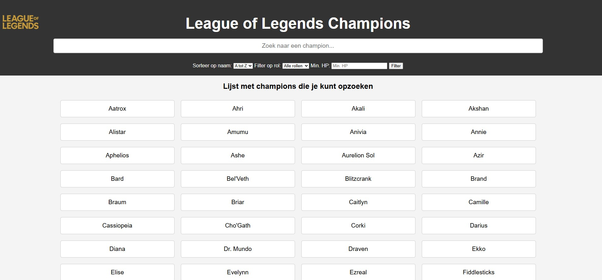

# Web-advanced-Project_Adam-Akkay

Een interactieve webapplicatie waarmee gebruikers champions uit League of Legends kunnen bekijken, filteren, sorteren en toevoegen aan hun favorieten. Gebouwd met HTML, CSS en JavaScript en gebruikmakend van de officiële Riot Games API (https://ddragon.leagueoflegends.com/cdn/14.3.1/data/en_US/champion.json).

Gebruikte API
Riot Games Data Dragon API :
 https://ddragon.leagueoflegends.com/cdn/14.3.1/data/en_US/champion.json

Afbeeldingen van champions komen van:
 http://ddragon.leagueoflegends.com/cdn/14.3.1/img/champion/{championId}.png

1. Functionaliteiten :

 Zoekfunctie: Typ de naam van een champion om live te filteren.

 Filteren op rol: Filter op Fighter, Mage, Tank, Assassin, Marksman of Support.

 Favorieten: Voeg champions toe aan favorieten, opgeslagen in localStorage.

 Filteren op minimum HP.

 Sorteren op naam (A-Z of Z-A).

 Homepagina met volledige lijst van champions die opgezocht kunnen worden.

 Champion-afbeeldingen en statistieken direct zichtbaar.

2. Modern Javascript:

Ophalen van data uit een externe API

→ Lijn 6–11 in app.js:
fetchChampions() maakt gebruik van fetch() en async/await om de champions op te halen vanuit de externe Riot Games API.

 Dynamisch tonen van gegevens

→ Lijn 13–35 in app.js:
displayChampions() genereert dynamisch HTML-elementen voor elke champion en voegt deze toe aan de DOM.

 Zoeken op naam via zoekbalk

→ Lijn 119–124 in app.js:
Real-time filtering van de lijst terwijl de gebruiker typt in de zoekbalk (addEventListener('input', ...)).

 Filteren op rol via dropdown

→ Lijn 87–90 in applyFilters():
De dropdown selecteert een rol zoals Mage, Tank, enz., en filtert de champions op basis van hun tags array.

 Gedetailleerde info van een geselecteerde champion

→ Lijn 36–69 in displayChampionInfo():
Maakt meerdere kolommen aan waarin naam, titel, rol, HP, aanvalsschade en afbeelding van de champion worden weergegeven.

 Sorteren op alfabetische volgorde (A-Z of Z-A)

→ Lijn 96–101 in sortChampions():
Sorteert de lijst van champions alfabetisch op basis van gebruikersselectie met localeCompare().

3. Opslag en Validatie

Toevoegen aan favorieten (met localStorage)
→ Lijn 70–78 in toggleFavorite():
Gebruikers kunnen een champion markeren als favoriet. Deze favorieten worden opgeslagen in localStorage en bij het opnieuw laden van de pagina opnieuw geladen (lijn 3).

 Filteren op minimum aantal HP
→ Lijn 91–92 in applyFilters():
Inputveld voor minimum HP valideert of het ingevoerde getal gelijk of hoger is dan de opgegeven waarde voordat het gefilterd wordt.

4. Styling en Layout (CSS)

Structuur van pagina-elementen
→ De layout gebruikt Flexbox voor een responsieve structuur:
#champion-list, #champion-info, .champion-column zijn gestileerd om kolommen en kaarten visueel aantrekkelijk weer te geven.

 Visuele highlight voor favorieten
→ In displayChampions() rond lijn 25:
Favoriete champions krijgen een gele achtergrondkleur (#ffd700) toegewezen voor visuele herkenning.

 Inputvelden en dropdowns gestyled
→ In styles.css:
Alle inputvelden (tekst, nummer, dropdowns) zijn opgemaakt met padding, border-radius, en breedte-aanpassingen voor betere UX.

 Responsieve afbeeldingen en tabelstyling
→ Champion-afbeeldingen zijn max-width: 100% en border-radius: 10px; tabellen gebruiken border-collapse en kleuraccenten voor headers.

5. Installatiehandleiding :

  Download of kloon de repository naar je lokale computer.

 Zorg dat de projectstructuur er als volgt uitziet:

    index.html – de hoofdpagina van de applicatie     
    src/
    styles.css – bevat de opmaak van de applicatie
    app.js – bevat de logica van de applicatie  
    images/ – map met o.a. het League of Legends-logo

 Open het bestand index.html in een moderne webbrowser (zoals Chrome of Firefox).

 Zorg ervoor dat je verbonden bent met het internet, zodat de API correct geladen wordt.

6. Screenshots :

Screen van de homepagina :

Homepagina : 

Sorteer op naam (Z-A) :
.png>)

Filter op rol : 

Minimum HP : 

Zoekbalk : 

Weergave champion info :

Favorieten knop gebruikt : 

7. Gebruikte bronnen :

Tijdens de ontwikkeling van dit project zijn onderstaande bronnen geraadpleegd voor technische ondersteuning, documentatie en probleemoplossing:

 Riot Games Developer Portal – Data Dragon API
De officiële API van Riot Games werd gebruikt om gegevens over League of Legends champions op te halen. De documentatie bood inzicht in de structuur van de API, de beschikbare endpoints en versies.
➤ https://developer.riotgames.com/docs/lol#data-dragon

 MDN Web Docs (Mozilla Developer Network)
Deze bron werd intensief gebruikt voor uitleg over moderne JavaScript-functies, DOM-manipulatie, event handling, CSS Flexbox en andere webstandaarden.
➤ https://developer.mozilla.org/

 W3Schools – JavaScript & CSS Tutorials
Voor snelle referenties en voorbeelden rond basisprincipes van JavaScript en CSS, waaronder HTML-structuren, styling en interactieve elementen.
➤ https://www.w3schools.com/js/
➤ https://www.w3schools.com/css/

 Stack Overflow
Voor het oplossen van specifieke programmeerproblemen, zoals het correct gebruik van localStorage, asynchrone data-ophaling met fetch(), en event listeners.
➤ https://stackoverflow.com/

Bron logo: https://logospng.org/d/?l=aHR0cHM6Ly9sb2dvc3BuZy5vcmcvZG93bmxvYWQvbGVhZ3VlLW9mLWxlZ2VuZHMvbGVhZ3VlLW9mLWxlZ2VuZHMtNDA5Ni5wbmd8TG9nbyBMZWFndWUgb2YgTGVnZW5kc3xMZWFndWUgb2YgTGVnZW5kcyBlIHVtIGpvZ28gZWxldHJvbmljbyBvbmxpbmUgZ3JhdHVpdG8sIGRvIGdlbmVybyBiYXRhbGhhIG11bHRpam9nYWRvciwgZGVzZW52b2x2aWRvIGUgcHVibGljYWRvIHBlbGEgUmlvdCBHYW1lcyBlbSAyMDA5Lg==

Cursusmateriaal

